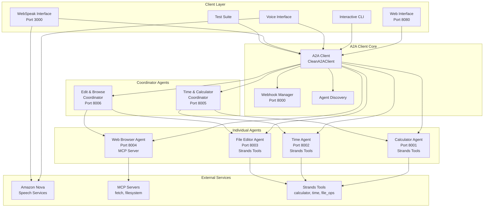
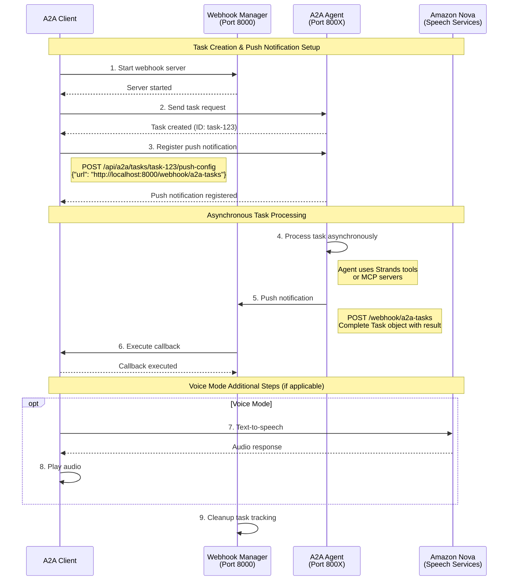
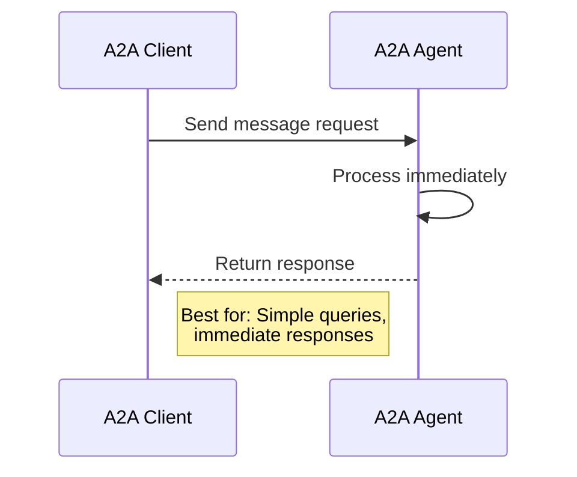
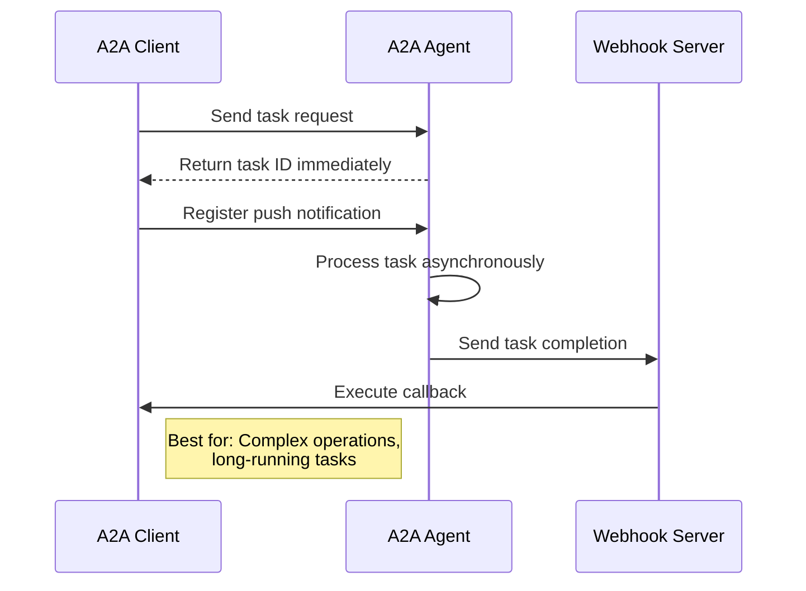
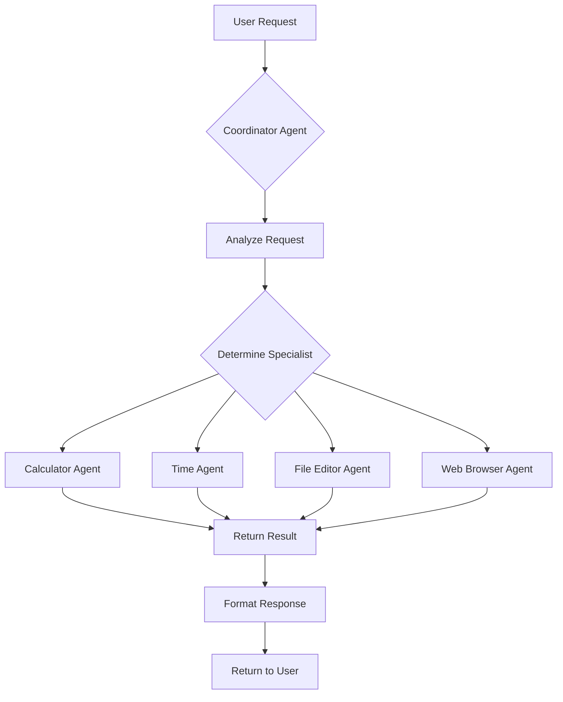
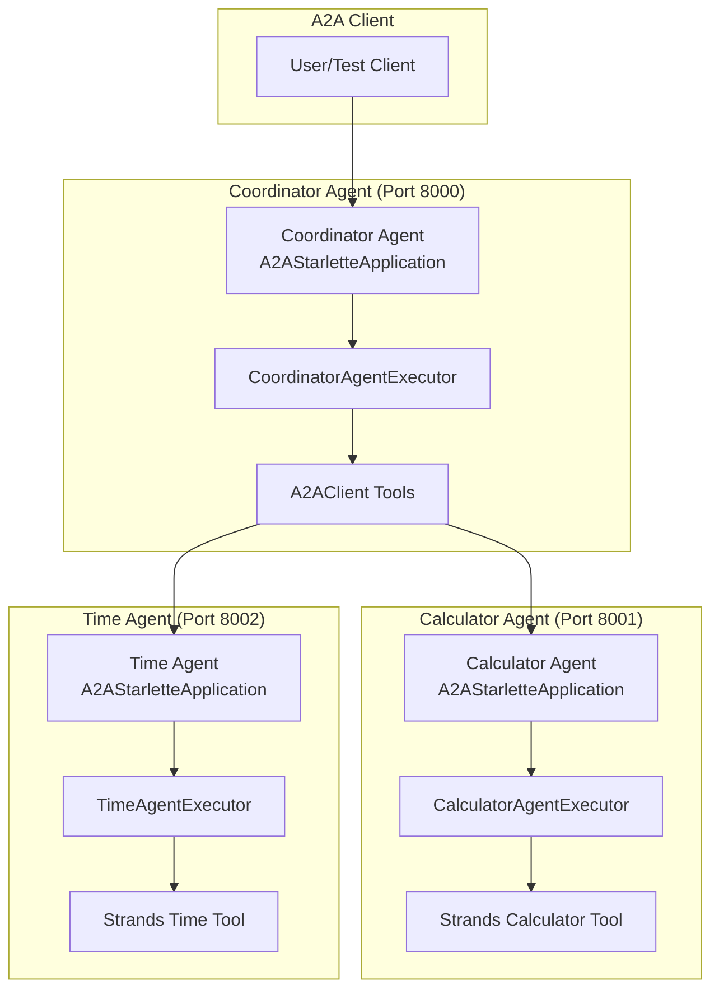

# Strands A2A Demo

This demo showcases multiple AI agents using the **complete official A2A (agent-to-agent) Python SDK patterns** from [google-a2a/a2a-samples](https://github.com/google-a2a/a2a-samples). The agents use the [Strands Agents Python SDK](https://strands-agents.com) for their LLM implementation, fully integrated with the official A2A SDK patterns.

**About A2A Protocol**: The [A2A (Agent-to-Agent) Protocol](https://google.github.io/A2A/) was originally developed by Google and is now being [transitioned to the Linux Foundation](https://blog.google/technology/ai/google-a2a-protocol-linux-foundation/) to ensure open governance and broad industry adoption for multi-agent AI systems.

> **📋 Implementation Note**: This project currently uses the official A2A Python SDK directly alongside Strands Agents SDK. It does **not** use the new native A2A support that may be available in newer versions of Strands Agents. This approach demonstrates how to integrate both SDKs manually for maximum control and compatibility with official A2A patterns.

This project features a unified `a2a-client` with multiple modes of operation, including web-based UI, voice interaction capabilities, and comprehensive testing.

## 🏗️ Agent Architecture

This system features **two distinct types of agents**, both configurable through `config/config.toml`:

### 🔧 **Individual Agents** (`configurable_agent`)
Specialized agents that perform specific tasks using tools:
- **Strands Tools**: Built-in capabilities like `calculator`, `current_time`, `file_read`, `file_write`, `editor`
- **MCP Servers**: External integrations via Model Context Protocol (e.g., web fetch, file systems)
- **Direct Communication**: Can be contacted directly by clients
- **Focused Expertise**: Each agent specializes in a particular domain

**Examples**: Calculator agent (math operations), Time agent (timezone queries), File Editor agent (file operations), Web Browser agent (content fetching)

### 🌀 **Coordinator Agents** (`coordinator_agent`) 
Meta-agents that orchestrate multiple individual agents:
- **No Direct Tools**: Don't use Strands tools or MCP servers directly
- **Agent Delegation**: Route requests to appropriate individual agents
- **Workflow Management**: Handle complex multi-step operations across agents
- **Intelligent Routing**: Analyze requests to determine which specialist agent(s) to use

**Examples**: Time & Calculator coordinator (manages math and time requests), Edit & Browse coordinator (manages file and web operations)

### 🔄 **How They Work Together**
```
User Request → Coordinator Agent → Individual Agent(s) → Tools/MCP → Results → User
```

Both types are automatically discovered and can be used through any client interface (web, CLI, voice).

## 📋 Table of Contents

- [Quick Start](#-quick-start)
- [A2A Client Modes Overview](#️-a2a-client-modes-overview)
- [Complete Tutorial](#-complete-tutorial)
- [Architecture Overview](#️-architecture-overview)
- [Configuration Guide](#️-configuration-guide)
- [Agent Management](#-agent-management)
- [Troubleshooting](#-troubleshooting)
- [API Reference](#-api-reference)

## 🚀 Quick Start

### Prerequisites
- **Python 3.12+**
- **UV package manager** (extremely fast Python package manager)

Install UV if you don't have it:
```bash
# macOS and Linux
curl -LsSf https://astral.sh/uv/install.sh | sh

# Windows
powershell -c "irm https://astral.sh/uv/install.ps1 | iex"

# Or visit: https://docs.astral.sh/uv/getting-started/installation/
```

### Installation

```bash
# Clone the repository
git clone <repository-url>
cd strands-a2a-demo

# Install dependencies with UV
uv sync
```

### Start All Agents

```bash
# Start all configured agents (recommended)
uv run agents start

# Wait for agents to be ready, then use the client
uv run a2a-client web
```

Open `http://localhost:8080` in your browser and start chatting with your agents!

## 🖥️ A2A Client Modes Overview

The `a2a-client` provides five distinct modes for interacting with A2A agents:

| Mode | Command | Purpose | Best For |
|------|---------|---------|----------|
| **`web`** | `uv run a2a-client web` | Modern browser-based UI | General use, demos, development |
| **`interactive`** | `uv run a2a-client interactive` | Command-line chat interface | Quick testing, scripting |
| **`speak`** | `uv run a2a-client speak --agent <name>` | CLI voice interaction | Voice testing, accessibility |
| **`webspeak`** | `uv run a2a-client webspeak` | Browser-based voice UI | Voice demos, user-friendly voice |
| **`test`** | `uv run a2a-client test` | Comprehensive test suite | Validation, CI/CD, debugging |

## 📖 Complete Tutorial

### Tutorial 1: Web Interface (Recommended for Beginners)

The web interface is the most user-friendly way to interact with A2A agents.

#### Step 1: Start the Agents
```bash
# Start all configured agents
uv run agents start

# Verify agents are running
uv run agents status
```

You should see output like:
```
✅ calculator (port 8001): Running (PID: 12345)
✅ time (port 8002): Running (PID: 12346)
✅ fileeditor (port 8003): Running (PID: 12347)
✅ webbrowser (port 8004): Running (PID: 12348)
✅ time-and-calculator (port 8005): Running (PID: 12349)
✅ edit-and-browse (port 8006): Running (PID: 12350)
```

#### Step 2: Launch Web Interface
```bash
# Start the web interface (default port 8080)
uv run a2a-client web

# Or specify a custom port
uv run a2a-client web --port 3000 --host 0.0.0.0
```

#### Step 3: Use the Interface
1. Open `http://localhost:8080` in your browser
2. You'll see a list of available agents with their capabilities
3. Select an agent from the dropdown
4. Type your message and press Enter or click Send
5. Watch real-time responses appear in the chat

#### Example Conversations:
```
👤 User: "What's 25 * 47?"
🤖 Calculator: "25 × 47 = 1,175"

👤 User: "What time is it in Tokyo?"
🤖 Time: "The current time in Tokyo is 2:30 PM JST (Japan Standard Time)"

👤 User: "Create a file called hello.txt with 'Hello World'"
🤖 File Editor: "✅ Created file hello.txt with content: 'Hello World'"
```

### Tutorial 2: Interactive CLI Mode

Perfect for developers and command-line users.

#### Basic Usage
```bash
# Start interactive mode
uv run a2a-client interactive

# Start with a specific agent
uv run a2a-client interactive --agent calculator

# Use task-based communication (with push notifications)
uv run a2a-client interactive --use-tasks
```

#### Step-by-Step Walkthrough:
```bash
# 1. Start interactive mode
uv run a2a-client interactive

# You'll see:
🎭 A2A Interactive Mode (Messages)
==================================================
📋 Available Agents:
  • calculator: Mathematical calculation specialist
  • time: Time and timezone information specialist
  ...

# 2. Select an agent by typing its name
Select an agent (or 'list' to see all, 'quit' to exit): calculator

# 3. Chat with the agent
💬 Chat with calculator (type 'back' to change agents, 'quit' to exit)
You: What's the square root of 144?

🤖 calculator: The square root of 144 is 12.

You: Calculate 15% tip on $50.75
🤖 calculator: 15% tip on $50.75 is $7.61. Total with tip: $58.36
```

#### Advanced CLI Features:
```bash
# Send a single message and exit
uv run a2a-client interactive --agent calculator --send "What's 100 * 25?"

# Use asynchronous tasks (better for complex operations)
uv run a2a-client interactive --use-tasks --agent fileeditor
```

### Tutorial 3: Voice Interaction (Speak Mode)

Voice interaction using Amazon Nova Sonic for speech-to-text and text-to-speech.

#### Prerequisites:
- AWS credentials configured (for Nova Sonic)
- Audio input/output devices

#### Setup AWS Credentials:
```bash
# Option 1: AWS CLI
aws configure

# Option 2: Environment variables
export AWS_ACCESS_KEY_ID=your_access_key
export AWS_SECRET_ACCESS_KEY=your_secret_key
export AWS_DEFAULT_REGION=us-east-1

# Option 3: IAM role (for EC2 instances)
# No additional setup needed
```

#### Using Speak Mode:
```bash
# Start voice interaction with an agent
uv run a2a-client speak --agent calculator

# Disable echo cancellation if using headphones
uv run a2a-client speak --agent time --disable-echo-cancellation
```

#### Voice Interaction Flow:
1. **Start speaking** - The system listens for your voice
2. **Speech-to-text** - Your speech is converted to text using Nova Sonic
3. **Agent processing** - The agent processes your request
4. **Text-to-speech** - The response is converted to speech
5. **Audio playback** - You hear the agent's response

#### Example Voice Session:
```
🎤 Voice mode started with calculator
🔊 Say something to the agent (press Ctrl+C to exit)

[You speak]: "What is twenty five times forty seven?"
📝 Transcription: "What is 25 times 47?"
🤖 calculator: "25 times 47 equals 1,175"
🔊 [Audio plays]: "Twenty five times forty seven equals one thousand one hundred seventy five"
```

### Tutorial 4: WebSpeak Interface

Browser-based voice interaction - combines the convenience of the web interface with voice capabilities.

#### Starting WebSpeak:
```bash
# Start WebSpeak interface (default port 3000)
uv run a2a-client webspeak

# Custom port and host
uv run a2a-client webspeak --port 8090 --host 0.0.0.0
```

#### Using WebSpeak:
1. Open `http://localhost:3000` in your browser
2. Allow microphone permissions when prompted
3. Select an agent from the dropdown
4. Click the microphone button to start speaking
5. See real-time transcription and responses
6. Hear audio responses automatically

#### WebSpeak Features:
- **Real-time transcription** - See your speech converted to text
- **Visual feedback** - Watch the conversation flow in the browser
- **Agent switching** - Change agents without restarting
- **Audio controls** - Mute, volume control, playback speed
- **WebRTC processing** - Client-side audio processing for better quality

### Tutorial 5: Testing Mode

Comprehensive testing suite to validate all agent functionality.

#### Basic Testing:
```bash
# Test all agents
uv run a2a-client test

# Test specific agent
uv run a2a-client test --agent calculator
uv run a2a-client test --agent time-and-calculator
```

#### Test Types Performed:
1. **Agent Discovery** - Verify agents are reachable and respond
2. **Skill Detection** - Check agent capabilities and skill descriptions
3. **Message Communication** - Test immediate request/response
4. **Task Communication** - Test asynchronous tasks with push notifications
5. **Coordinator Testing** - Test agent-to-agent delegation

#### Sample Test Output:
```
🧪 A2A Client Test Suite
========================

🔍 Discovering agents...
✅ Found 6 agents: calculator, time, fileeditor, webbrowser, time-and-calculator, edit-and-browse

🎯 Testing agent skills and descriptions...
✅ calculator: Advanced mathematical calculation agent
   Skills: calculate (Perform mathematical calculations and solve equations)
✅ time: Accurate time and timezone information agent  
   Skills: get_current_time (Get current time and timezone information)

📨 Testing message communication...
✅ calculator: Responded to 'What is 12 * 8?' with '12 × 8 = 96'
✅ time: Responded to 'What time is it?' with 'Current time: 2:30 PM EST'

🚀 Testing task communication with push notifications...
✅ calculator: Task completed with result: '√144 = 12'
✅ time: Task completed with result: 'Current UTC time: 19:30:15'

📊 Test Summary:
   • Agent Discovery: ✅ 6/6 passed
   • Message Tests: ✅ 6/6 passed  
   • Task Tests: ✅ 6/6 passed
   • Push Notifications: ✅ 6/6 passed
```

## 🏗️ Architecture Overview

### System Architecture



### Architecture Components

#### Client Layer
- **Web Interface**: Modern browser-based UI with real-time WebSocket communication
- **Interactive CLI**: Command-line interface for direct agent interaction
- **Voice Interface**: CLI-based voice interaction using Amazon Nova
- **WebSpeak Interface**: Browser-based voice interaction with WebRTC
- **Test Suite**: Comprehensive testing framework for all agents

#### A2A Client Core
- **CleanA2AClient**: Core A2A SDK integration with connection management
- **Webhook Manager**: Handles push notifications for asynchronous tasks
- **Agent Discovery**: Dynamic discovery of available agents and their capabilities

#### Agent Types
- **Individual Agents**: Specialized agents for specific tasks
- **Coordinator Agents**: Meta-agents that delegate tasks to individual agents

#### Integration Points
- **Strands Tools**: Native Python tools for calculator, time, and file operations
- **MCP Servers**: Model Context Protocol servers for external integrations
- **Amazon Nova**: Speech-to-text and text-to-speech services

### A2A Task Webhook Sequence



### Message vs Task Communication

#### Message Communication (Synchronous)


#### Task Communication (Asynchronous)


### Agent Coordination Flow


</code_block_to_apply_changes_from>
</invoke>
</function_calls>

## ⚙️ Configuration Guide

### Configuration File Structure

All agents are configured through `config/config.toml`. This single file defines:
- Agent types and capabilities
- Port assignments
- Tool integrations
- Coordinator relationships

#### Basic Structure
```toml
[logging]
level = "INFO"
log_directory = "./logs"

[webhook]
port = 8000
host = "0.0.0.0"

[web_interface]
port = 8080
host = "0.0.0.0"
webspeak_port = 8081

[agents]
model = "us.amazon.nova-lite-v1:0"

# Individual agents
[configurable_agent.agent_name]
# ... agent configuration

# Coordinator agents  
[coordinator_agent.coordinator_name]
# ... coordinator configuration
```

### Individual Agent Configuration

```toml
[configurable_agent.myagent]
description = "Description of what this agent does"
port = 8001                                    # Unique port number
system_prompt = "You are a helpful assistant..."
strands_tools = ["calculator", "current_time"] # Optional Strands tools

# Optional MCP server integrations
[configurable_agent.myagent.mcp_servers]
fetch = { command = "uvx", args = ["mcp-server-fetch"] }
```

**Required Fields:**
- `description`: Human-readable description
- `port`: Unique port number (8001-8099 recommended for individual agents)
- `system_prompt`: Agent behavior definition

**Optional Fields:**
- `strands_tools`: Array of Strands tool names
- `mcp_servers`: MCP server configurations

### Coordinator Agent Configuration

```toml
[coordinator_agent.mycoordinator]
description = "Coordinator that manages specific agents"
port = 8000
system_prompt = "You are a coordinator agent..."
coordinated_agents = ["agent1", "agent2"]  # Agents this coordinator manages
```

### Available Strands Tools

| Tool | Purpose | Example Use |
|------|---------|-------------|
| `calculator` | Mathematical calculations | "What's 25 * 47?" |
| `current_time` | Time and timezone info | "What time is it in Tokyo?" |
| `editor` | File editing with changes | "Edit line 5 of config.py" |
| `file_read` | Advanced file reading | "Read the contents of README.md" |
| `file_write` | File writing operations | "Create a new Python script" |

### MCP Server Integration

MCP (Model Context Protocol) servers extend agent capabilities:

```toml
[configurable_agent.webbrowser.mcp_servers]
fetch = { command = "uvx", args = ["mcp-server-fetch"] }
filesystem = { command = "mcp-server-filesystem", args = ["/path/to/root"] }
```

Common MCP servers:
- **fetch**: Web content retrieval
- **filesystem**: File system operations
- **sqlite**: Database interactions
- **brave-search**: Web search capabilities

### Port Management Strategy

**Recommended Port Ranges:**
- **8001-8099**: Individual configurable agents
- **8000, 8100-8199**: Coordinator agents
- **8000**: Webhook server (fixed)
- **8080**: Web interface (default)
- **3000**: WebSpeak interface (default)

**Port Conflict Resolution:**
```bash
# Check what's using a port
lsof -i :8001

# Force start agents (kills existing processes)
uv run agents start --force
```

### Example Complete Configuration

```toml
[logging]
level = "INFO"
log_directory = "./logs"

[webhook]
port = 8000
host = "0.0.0.0"

[agents]
model = "us.amazon.nova-lite-v1:0"

# Specialized math agent
[configurable_agent.calculator]
description = "Advanced mathematical calculation specialist"
port = 8001
system_prompt = "You are a precise calculator. Solve problems step by step."
strands_tools = ["calculator"]

[configurable_agent.calculator.mcp_servers]

# Web research agent
[configurable_agent.researcher]
description = "Web research and content analysis specialist"
port = 8004
system_prompt = "You are a research assistant. Find and analyze web content."
strands_tools = []

[configurable_agent.researcher.mcp_servers]
fetch = { command = "uvx", args = ["mcp-server-fetch"] }
brave_search = { command = "uvx", args = ["mcp-server-brave-search"] }

# Multi-purpose coordinator
[coordinator_agent.assistant]
description = "General purpose coordinator for math and research"
port = 8000
system_prompt = "You coordinate between math and research specialists."
coordinated_agents = ["calculator", "researcher"]
```

## 🔧 Agent Management

### Starting and Stopping Agents

#### Start All Agents (Recommended)
```bash
# Start all configured agents with dependency ordering
uv run agents start

# Force start (kills existing processes on ports)
uv run agents start --force
```

#### Start Individual Agents
```bash
# Start specific configurable agent
uv run agents start calculator
uv run agents start time
uv run agents start fileeditor

# Start specific coordinator
uv run agents start time-and-calculator
uv run agents start edit-and-browse
```

#### Stop Agents
```bash
# Stop all agents
uv run agents stop

# Stop specific agent
uv run agents stop calculator
uv run agents stop time-and-calculator
```

#### Restart Agents
```bash
# Restart all agents
uv run agents restart

# Restart specific agent
uv run agents restart calculator
```

#### Check Agent Status
```bash
# Check all agents
uv run agents status

# Check specific agent
uv run agents status calculator
```

Sample status output:
```
📊 Agent Status Report
=====================

✅ calculator (port 8001): Running (PID: 12345)
   📍 URL: http://localhost:8001
   🕐 Started: 2024-01-15 14:30:22
   📝 Log: ./logs/calculator.log

✅ time (port 8002): Running (PID: 12346)
   📍 URL: http://localhost:8002
   🕐 Started: 2024-01-15 14:30:23
   📝 Log: ./logs/time.log

❌ webbrowser (port 8004): Not running
   📝 Log: ./logs/webbrowser.log
```

### Manual Agent Startup (Alternative)

For development or debugging, you can start agents manually:

```bash
# Individual configurable agents
uv run configurable-agent calculator    # Port 8001
uv run configurable-agent time          # Port 8002
uv run configurable-agent fileeditor    # Port 8003
uv run configurable-agent webbrowser    # Port 8004

# Coordinator agents
uv run coordinator-agent time-and-calculator  # Port 8005
uv run coordinator-agent edit-and-browse      # Port 8006
```

### Agent Dependency Management

The system automatically manages agent dependencies:

1. **Independent agents** start first (calculator, time, fileeditor, webbrowser)
2. **Coordinator agents** start after their dependencies are ready
3. **Health checks** ensure agents are ready before starting dependents

### Log Management

Each agent maintains its own log file in the `./logs/` directory:
- `./logs/calculator.log` - Calculator agent logs
- `./logs/time.log` - Time agent logs
- `./logs/fileeditor.log` - File editor agent logs
- `./logs/webbrowser.log` - Web browser agent logs
- `./logs/time-and-calculator.log` - Time & calculator coordinator logs
- `./logs/edit-and-browse.log` - Edit & browse coordinator logs

#### Viewing Logs
```bash
# View real-time logs
tail -f ./logs/calculator.log

# View recent log entries
uv run log-viewer calculator

# View all agent logs
uv run log-viewer --all
```

### Default Agent Configuration

The system comes with these pre-configured agents:

| Agent | Type | Port | Capabilities | Tools/MCP |
|-------|------|------|-------------|-----------|
| `calculator` | Individual | 8001 | Mathematical calculations | Strands calculator |
| `time` | Individual | 8002 | Time and timezone info | Strands current_time |
| `fileeditor` | Individual | 8003 | File operations | Strands editor, file_read, file_write |
| `webbrowser` | Individual | 8004 | Web content fetching | MCP fetch server |
| `time-and-calculator` | Coordinator | 8005 | Math & time coordination | Manages calculator + time |
| `edit-and-browse` | Coordinator | 8006 | File & web coordination | Manages fileeditor + webbrowser |

## 🛠️ Troubleshooting

### Common Issues and Solutions

#### 1. Agents Won't Start
```bash
# Check if ports are in use
lsof -i :8001
lsof -i :8002

# Force start to kill existing processes
uv run agents start --force

# Check logs for specific errors
tail -f ./logs/calculator.log
```

#### 2. "Connection Refused" Errors
```bash
# Verify agents are running
uv run agents status

# Restart all agents
uv run agents restart

# Check network connectivity
curl http://localhost:8001/.well-known/agent.json
```

#### 3. Voice Mode Issues (Nova Sonic)
```bash
# Check AWS credentials
aws sts get-caller-identity

# Set credentials if needed
export AWS_ACCESS_KEY_ID=your_key
export AWS_SECRET_ACCESS_KEY=your_secret
export AWS_DEFAULT_REGION=us-east-1

# Test audio devices
uv run a2a-client speak --agent calculator --disable-echo-cancellation
```

#### 4. WebSpeak Not Working
```bash
# Check microphone permissions in browser
# Ensure port 3000 is available
lsof -i :3000

# Try different port
uv run a2a-client webspeak --port 8090
```

#### 5. Push Notifications Not Working
```bash
# Check webhook server
curl http://localhost:8000/health

# Verify webhook port in config
grep -A5 "\[webhook\]" config/config.toml

# Restart with clean state
uv run agents stop
uv run agents start
```

### Debugging Commands

```bash
# Enable debug logging
export STRANDS_LOG_LEVEL=DEBUG

# View all logs in real-time
tail -f ./logs/*.log

# Test individual agent
curl http://localhost:8001/.well-known/agent.json | jq

# Test webhook connectivity
curl -X POST http://localhost:8000/webhook/a2a-tasks \
  -H "Content-Type: application/json" \
  -d '{"test": "webhook"}'
```

### Performance Optimization

#### For Better Response Times:
```toml
# In config/config.toml, use faster model
[agents]
model = "us.amazon.nova-lite-v1:0"  # Fastest
# model = "us.amazon.nova-pro-v1:0"    # Balanced
# model = "us.amazon.nova-premier-v1:0" # Best quality
```

#### For Memory Usage:
```bash
# Monitor memory usage
ps aux | grep -E "(configurable-agent|coordinator-agent)"

# Restart agents if memory usage is high
uv run agents restart
```

## 📚 API Reference

### A2A Client Core API

#### CleanA2AClient Class
```python
from a2a_client import CleanA2AClient

# Initialize client
client = CleanA2AClient("http://localhost:8001", "calculator")

# Discover agent capabilities
await client.discover_agent_skills()

# Send immediate message
response = await client.send_message("What is 25 * 47?")

# Send asynchronous task
def callback(task):
    print(f"Task completed: {client.extract_task_result(task)}")

task_id = await client.send_task("Complex calculation", callback)
```

#### Agent Management API
```python
from agent_process_manager import AgentProcessManager

manager = AgentProcessManager()

# Start all agents
success = manager.start_all_agents()

# Get agent status
status = manager.get_agent_status()

# Stop all agents
manager.stop_all_agents()
```

### Configuration API

#### Loading Configuration
```python
import tomllib
from pathlib import Path

def load_config():
    config_path = Path("config/config.toml")
    with open(config_path, "rb") as f:
        return tomllib.load(f)

config = load_config()
agents = config.get("configurable_agent", {})
```

#### Agent Discovery
```python
from a2a_client import discover_available_agents

# Get all available agents
agents = discover_available_agents()
# Returns: {"calculator": "http://localhost:8001", ...}
```

### Webhook API

#### Push Notification Management
```python
from a2a_push_notification_manager import get_client_webhook_manager

webhook_manager = get_client_webhook_manager()
await webhook_manager.start()

# Register task callback
success = await webhook_manager.register_task_callback(
    client=a2a_client,
    task_id="task-123",
    callback=my_callback,
    timeout_seconds=300.0
)
```

### Testing API

#### Test Runner
```python
from test_interface import test_mode

# Run all tests
await test_mode("all")

# Test specific agent
await test_mode("calculator")
```

### Voice API

#### Speech Integration
```python
from speak_interface import speak_mode
from aws_credentials_helper import ensure_aws_credentials

# Ensure AWS credentials
ensure_aws_credentials()

# Start voice mode
await speak_mode("calculator", disable_echo_cancellation=False)
```

## 🔗 Quick Reference

### Essential Commands
```bash
# Setup and start
uv sync                              # Install dependencies
uv run agents start                  # Start all agents
uv run a2a-client web               # Launch web interface

# Agent management
uv run agents status                # Check agent status
uv run agents restart               # Restart all agents
uv run agents stop                  # Stop all agents

# Client modes
uv run a2a-client interactive       # CLI chat mode
uv run a2a-client speak --agent calculator  # Voice mode
uv run a2a-client webspeak         # Web voice interface
uv run a2a-client test             # Run test suite

# Individual agents (manual)
uv run configurable-agent calculator
uv run coordinator-agent time-and-calculator
```

### Default Ports
- **8001**: Calculator agent
- **8002**: Time agent  
- **8003**: File editor agent
- **8004**: Web browser agent
- **8005**: Time & calculator coordinator
- **8006**: Edit & browse coordinator
- **8000**: Webhook server
- **8080**: Web interface
- **3000**: WebSpeak interface

### Configuration Files
- **`config/config.toml`**: Main configuration
- **`./logs/*.log`**: Agent log files
- **`./state/agents.json`**: Agent state persistence

## **⚙️ Advanced Configuration**

### **Basic Structure**

```toml
[logging]
level = "INFO"

[webhook]
port = 8910
host = "0.0.0.0"

[agents]
model = "us.amazon.nova-lite-v1:0"

# Individual configurable agents
[configurable_agent.<agent_name>]
# ... agent configuration

# Coordinator agents that manage groups
[coordinator_agent.<coordinator_name>]
# ... coordinator configuration
```

### **Configurable Agent Syntax**

Each configurable agent is defined using the `[configurable_agent.<name>]` section:

```toml
[configurable_agent.myagent]
description = "Description of what this agent does"
port = 8001
system_prompt = "You are a helpful assistant..."
strands_tools = ["tool1", "tool2"]  # Optional: Strands tools to load

# Optional: MCP servers to connect to
[configurable_agent.myagent.mcp_servers]
server_name = { command = "command", args = ["arg1", "arg2"] }
```

**Required Fields:**
- `description`: Human-readable description of the agent's purpose
- `port`: Port number where the agent will run (must be unique)
- `system_prompt`: The system prompt that defines the agent's behavior

**Optional Fields:**
- `strands_tools`: Array of Strands tool names to load (e.g., `["calculator", "current_time"]`)
- `mcp_servers`: Section defining MCP servers to connect to

### **Coordinator Agent Syntax**

Coordinator agents manage groups of other agents:

```toml
[coordinator_agent.mycoordinator]
description = "Coordinator that manages specific agents"
port = 8000
system_prompt = "You are a coordinator agent..."
coordinated_agents = ["agent1", "agent2"]
```

**Required Fields:**
- `description`: Human-readable description of the coordinator's purpose
- `port`: Port number where the coordinator will run (must be unique)
- `system_prompt`: The system prompt for coordination behavior
- `coordinated_agents`: Array of agent names this coordinator manages

### **Available Strands Tools**

The system supports these built-in Strands tools:

- **`calculator`**: Mathematical calculations and equation solving
- **`current_time`**: Current time and timezone information
- **`editor`**: File editing with iterative changes
- **`file_read`**: Advanced file reading capabilities
- **`file_write`**: File writing with confirmation

### **MCP Server Configuration**

MCP (Model Context Protocol) servers can be configured per agent:

```toml
[configurable_agent.myagent.mcp_servers]
fetch = { command = "uvx", args = ["mcp-server-fetch"] }
filesystem = { command = "mcp-server-filesystem", args = ["/path/to/root"] }
```

### **Complete Example**

Here's a complete example showing different types of agents:

```toml
[logging]
level = "INFO"

[webhook]
port = 8910
host = "0.0.0.0"

[agents]
model = "us.amazon.nova-lite-v1:0"

# Math specialist using Strands calculator tool
[configurable_agent.calculator]
description = "Mathematical calculation specialist"
port = 8001
system_prompt = "You are a precise calculator. Solve math problems step by step."
strands_tools = ["calculator"]

[configurable_agent.calculator.mcp_servers]
# No MCP servers for this agent

# Web browsing agent using MCP fetch server
[configurable_agent.webbrowser]
description = "Web content fetching specialist"
port = 8004
system_prompt = "You are a web browsing assistant. Fetch and analyze web content."
strands_tools = []

[configurable_agent.webbrowser.mcp_servers]
fetch = { command = "uvx", args = ["mcp-server-fetch"] }

# Coordinator managing both agents
[coordinator_agent.main]
description = "Main coordinator managing math and web agents"
port = 8000
system_prompt = "You coordinate tasks between math and web agents."
coordinated_agents = ["calculator", "webbrowser"]
```

### **Adding New Agents**

To add a new agent:

1. **Choose a unique name** and port number
2. **Add a `[configurable_agent.<name>]` section** with required fields
3. **Specify tools or MCP servers** the agent should use
4. **Restart the agent** with `uv run configurable-agent <name>`
5. **Optional**: Add to a coordinator's `coordinated_agents` list

The system will automatically discover and make the new agent available to all clients.

### **Port Management**

**Recommended Port Ranges:**
- **8001-8099**: Individual configurable agents
- **8000, 8100-8199**: Coordinator agents  
- **8910**: Webhook server (fixed)
- **8080**: Web interface (default)
- **3000**: WebSpeak interface (default)

**Important**: Each agent must have a unique port number.

## 🎤 **WebSpeak Voice Interface**

The demo now includes a **web-based voice interface** that allows natural voice conversations with A2A agents using Amazon Nova Sonic and WebRTC:

### **Features**
- **Browser-based Voice Interaction**: No downloads needed, works in any modern browser
- **WebRTC Audio Processing**: Built-in echo cancellation, noise suppression, and auto-gain control
- **Real-time Conversation**: See transcriptions and responses in real-time
- **Agent Discovery**: Visual agent selection with skills display
- **Tool Visualization**: Watch agents use tools in real-time
- **Multi-Agent Support**: Switch between agents without restarting

### **Quick Start**
```bash
# Start the WebSpeak server
uv run a2a-client webspeak

# Open browser to http://localhost:3000
# Select an agent and start talking!
```

### **Technical Architecture**
- **Frontend**: HTML5/WebRTC for audio processing + SocketIO for real-time communication
- **Backend**: Flask-SocketIO server using the same A2A integration as CLI speak mode
- **Audio Flow**: Browser WebRTC → Nova Sonic → A2A Agents → Voice responses
- **Advantages**: Client-side audio processing, remote access, visual feedback

See `webspeak/README.md` for detailed documentation.

## 🔄 **Agent-to-Agent Communication Flow**



## 📖 **Implementation Notes**

### **Official Patterns Followed**
- **Server Pattern**: `A2AStarletteApplication` + `DefaultRequestHandler` + `AgentExecutor`
- **Client Pattern**: `A2AClient` + `A2ACardResolver` for discovery
- **Messaging Pattern**: `new_agent_text_message()` for responses
- **Context Pattern**: `RequestContext` + `EventQueue` for task execution
- **Task Pattern**: `InMemoryTaskStore` for task management

### **Strands Integration**
- Strands Agents SDK provides the LLM backbone
- Official A2A SDK provides the communication layer
- Seamless integration between both frameworks
- Tool sharing between Strands and A2A contexts

## 🚀 **What's Next?**

This implementation provides a solid foundation for:
- **Building production A2A agent networks**
- **Integrating with existing LLM applications**
- **Creating specialized agent marketplaces**
- **Implementing complex multi-agent workflows**

The codebase follows official patterns exactly, making it easy to:
- Add new agents following the same structure
- Scale to larger agent networks
- Integrate with other A2A-compatible systems
- Deploy in production environments

## 📋 **Quick Reference**

### **Managing Agents**
```bash
# Agent management (recommended)
uv run agents start                        # Start all agents
uv run agents start calculator             # Start specific agent
uv run agents stop                         # Stop all agents  
uv run agents stop time                    # Stop specific agent
uv run agents restart                      # Restart all agents
uv run agents restart coordinator          # Restart specific agent
uv run agents status                       # Check all agent status
uv run agents status webbrowser            # Check specific agent status
```

### **Starting Agents Individually (Alternative)**
```bash
# Individual configurable agents
uv run calculator-agent                    # Port 8001
uv run time-agent                          # Port 8002
uv run configurable-agent fileeditor      # Port 8003
uv run configurable-agent webbrowser      # Port 8004

# Coordinator agents
uv run coordinator-agent time-and-calculator  # Port 8000
uv run coordinator-agent edit-and-browse      # Port 8005
```

### **Using the A2A Client**
```bash
# Web interface (recommended)
uv run a2a-client web                      # http://localhost:8080

# Interactive CLI
uv run a2a-client interactive              # Terminal-based chat
uv run a2a-client interactive --agent calculator  # Direct agent chat

# Voice interfaces
uv run a2a-client speak --agent coordinator       # CLI voice mode
uv run a2a-client webspeak                        # Web voice interface

# Testing
uv run a2a-client test                     # Comprehensive test suite
uv run a2a-client test --agent calculator # Test specific agent only
```

### **Configuration Quick Start**
```toml
# Add a new agent
[configurable_agent.myagent]
description = "My custom agent"
port = 8010
system_prompt = "You are a helpful assistant."
strands_tools = ["calculator"]

# Add a coordinator
[coordinator_agent.mycoordinator]
description = "My coordinator"
port = 8020
system_prompt = "You coordinate tasks."
coordinated_agents = ["myagent", "calculator"]
```

## 📚 References

### A2A Protocol Resources
- [Official A2A Specification](https://google.github.io/A2A/) - Complete protocol documentation
- [A2A Python SDK (GitHub)](https://github.com/google-a2a/a2a-sdk-python) - Official Python implementation
- [A2A Python Samples](https://github.com/google-a2a/a2a-samples/tree/main/samples/python) - Reference implementations
- [A2A SDK Documentation](https://pypi.org/project/a2a-sdk/) - PyPI package documentation
- [Google Transfers A2A to Linux Foundation](https://blog.google/technology/ai/google-a2a-protocol-linux-foundation/) - Official announcement

### Strands Agents Resources
- [Strands Agents](https://strands-agents.com) - Official website and documentation
- [Strands Agents SDK (GitHub)](https://github.com/strands-agents/sdk-python) - Python SDK repository

### Development Tools
- [UV Documentation](https://docs.astral.sh/uv/) - Fast Python package manager
- [Amazon Nova Documentation](https://docs.aws.amazon.com/nova/) - Speech services for voice modes
- [Python A2A Tutorial](https://a2aprotocol.ai/blog/python-a2a-tutorial-20250513) - Getting started guide

---

**🚀 Built with ❤️ using the official A2A SDK patterns and Strands Agents SDK**

*Ready to build your own agent network? Start with `uv sync && uv run agents start && uv run a2a-client web`*
